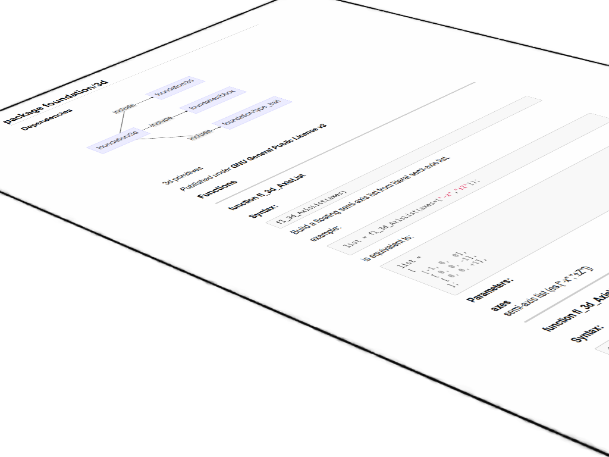

# OrthoDocs



[](https://sonarcloud.io/summary/new_code?id=ggabbiani_orthodocs)

OrthoDocs is a API documentation generator and a static analysis tool for the OpenSCAD scripting language. For the list of the feature planned and their status see [Project status](#project-status).

## Design

OrthoDocs comes with a complete OpenSCAD language parser, able to recognize all the public functions, modules and variables found in the source tree, complete with parameters and their default values. Sources to be documented can be passed as files, directories or both. Each source file will produce a corresponding API document, we call these API groups as **packages**.
Even in a completely uncommented source tree, OrthoDocs will create a number of API documents each of them with the following items:

* package name;
* package dependency tree (in textual or graphical mode);
* global (top level) variables (name and default value);
* functions signatures (function name, parameters and their default values);
* public (not nested) modules signature (name, parameters and their default values).

The following uncommented code

```text
include <2d.scad>
include <bbox.scad>
include <type_trait.scad>

function fl_3d_AxisList(axes) = ... ;

function fl_3d_axisIsSet(axis,list) = ... ;

module fl_cube(verbs = FL_ADD, size = [1,1,1], octant,direction) {
...
}

e = 2.71828;

module fl_cylinder(verbs  = FL_ADD,h,r,r1,r2,d,d1,d2,octant,direction) {
...
}
```

once analyzed by OrthoDocs will produce the following [formatted document](examples/uncommented.md):

### Annotations

Annotations are single line or block comments in which the comment start is immediately followed by the `!` character. All the other comments will be ignored.

The previous code with comments and annotations:

```text
/*!
 * 3d primitives replacing native OpenSCAD ones.
 */

include <2d.scad>
include <bbox.scad>
include <type_trait.scad>

/*!
 * Build a floating semi-axis list from literal semi-axis list.
 *
 * example:
 *
 *     list = fl_3d_AxisList(axes=["-x","±Z"]);
 *
 * is equivalent to:
 *
 *     list =
 *     [
 *      [-1, 0,  0],
 *      [ 0, 0, -1],
 *      [ 0, 0, +1],
 *     ];
 */
function fl_3d_AxisList(
  //! semi-axis list (es.["-x","±Z"])
  axes
) = ... ;

//! wether «axis» is present in floating semi-axis list
function fl_3d_axisIsSet(axis,list) = ... ;

/*!
 * cube replacement
 */
module fl_cube(
  //! FL_ADD,FL_AXES,FL_BBOX
  verbs     = FL_ADD,
  size      = [1,1,1],
  //! when undef native positioning is used
  octant,
  //! desired direction [director,rotation] or native direction if undef
  direction
) {
...
}

/*!
 * The number e, also known as Euler's number, is a mathematical
 * constant approximately equal to 2.71828 which can be characterized
 * in many ways.
 */
e = 2.71828;

/*!
 * cylinder replacement
 */
module fl_cylinder(
  //! FL_ADD,FL_AXES,FL_BBOX
  verbs  = FL_ADD,
  //! height of the cylinder or cone
  h,
  //! radius of cylinder. r1 = r2 = r.
  r,
  //! radius, bottom of cone.
  r1,
  //! radius, top of cone.
  r2,
  //! diameter of cylinder. r1 = r2 = d / 2.
  d,
  //! diameter, bottom of cone. r1 = d1 / 2.
  d1,
  //! diameter, top of cone. r2 = d2 / 2.
  d2,
  //! when undef native positioning is used
  octant,
  //! desired direction [director,rotation], native direction when undef ([+X+Y+Z])
  direction
) {
...
}
```
will produce an [annotated document](examples/annotated.md)

### Other features

Given a source tree, it is possible to:
* generate a global Table of Contents referencing all the documented APIs;
* generate one or more [dependency graphs](examples/dependecies.md) located at different position of the source tree in order to have clear understanding of the packages correlations.


## The command line

## Project status

| Feature      | Status
| -----------  | ------
| [admonitions](https://www.markdownguide.org/hacks/#admonitions)| ✔
| comment styles            | ✔ 
| cross-reference           | 🚧  
| dependency graphs         | ✔
| global values             | ✔
| source license detection  | ✔
| table of contents         | ✔

Legenda:

| Symbol | Description  |
|--------|--------------|
|✔       | done         |
|🚧      | on going     |
