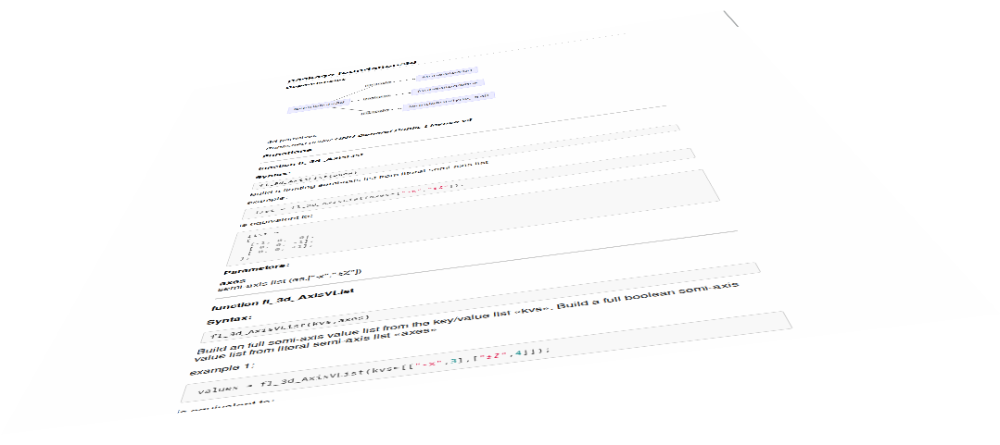

# OrthoDocs

OrthoDocs is an API documentation generator and static analysis tool for the OpenSCAD scripting language. For the list of the feature planned and their status see [Project status](#project-status).

## Design

OrthoDocs comes with a complete OpenSCAD language parser, able to recognize all the public global functions, modules and variables found in the source tree, complete with parameters and their default values. Sources can be passed as files, directories or both. Each source file (here referred to as *package*) will produce a corresponding API document.
Even in a completely uncommented source tree, OrthoDocs will create a document with the following items:

* package name;
* package dependency tree (in textual or graphical mode);
* global variables (name and eventual default value);
* global functions signatures (function name, parameters and eventual defaults);
* global modules signature (name, parameters and eventual defaults);
* one optional Table of Contents for all the items documented in the whole source tree;
* any number of dependecy graphs reassuming the system parts correlation in whatever part of the source tree.

[Here](docs/examples/documents/uncommented.md) you can find the produced document from a [completely uncommented source file](docs/examples/sources/uncommented.scad):

### Annotations

Orthodocs annotations are single line or C style block comments in which the comment start is immediately followed by the `!` character. All the other comments are ignored.

    /*
     * This is a C-style block comment and is ignored by OrthoDocs
     */

    // This is a single line comment ignored as well

    /*!
     * This is a C-style block comment interpreted as a multi line annotation
     */

     //! This is a single line comment interpreted as a single line annotation

[Here](docs/examples/documents/annotated.md) a document example from the same [source file enriched with annotations](docs/examples/sources/annotated.scad).

## The command line

## Project status

| Feature                   | Status
| ------------------------- | ------
| [admonitions](https://www.markdownguide.org/hacks/#admonitions)| ✔
| comment styles            | ✔
| cross-reference           | 🚧
| dependency graphs         | ✔
| global values             | ✔
| Linux support             | ✔
| macOS support             | ✔
| source license detection  | ✔
| table of contents         | ✔
| Windows support           | 🚧

Legenda:

| Symbol | Description  |
|--------|--------------|
|✔       | done         |
|🚧      | on going     |
