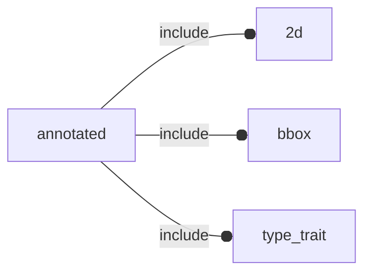

# package annotated

## Dependencies



3d primitives replacing native OpenSCAD ones.

## Variables

---

### variable e

__Default:__

    2.71828

The number e, also known as Euler's number, is a mathematical
constant approximately equal to 2.71828 which can be characterized
in many ways.


## Functions

---

### function fl_3d_AxisList

__Syntax:__

```text
fl_3d_AxisList(axes)
```

Build a floating semi-axis list from literal semi-axis list.

example:

    list = fl_3d_AxisList(axes=["-x","±Z"]);

is equivalent to:

    list =
    [
     [-1, 0,  0],
     [ 0, 0, -1],
     [ 0, 0, +1],
    ];

:memo: __note:__ this is an admonition!


__Parameters:__

__axes__  
semi-axis list (es.["-x","±Z"])


---

### function fl_3d_axisIsSet

__Syntax:__

```text
fl_3d_axisIsSet(axis,list)
```

wether «axis» is present in floating semi-axis list

## Modules

---

### module fl_cube

__Syntax:__

    fl_cube(verbs=FL_ADD,size=[1,1,1],octant,direction)

cube replacement


__Parameters:__

__verbs__  
FL_ADD,FL_AXES,FL_BBOX

__octant__  
when undef native positioning is used

__direction__  
desired direction [director,rotation] or native direction if undef


---

### module fl_cylinder

__Syntax:__

    fl_cylinder(verbs=FL_ADD,h,r,r1,r2,d,d1,d2,octant,direction)

cylinder replacement


__Parameters:__

__verbs__  
FL_ADD,FL_AXES,FL_BBOX

__h__  
height of the cylinder or cone

__r__  
radius of cylinder. r1 = r2 = r.

__r1__  
radius, bottom of cone.

__r2__  
radius, top of cone.

__d__  
diameter of cylinder. r1 = r2 = d / 2.

__d1__  
diameter, bottom of cone. r1 = d1 / 2.

__d2__  
diameter, top of cone. r2 = d2 / 2.

__octant__  
when undef native positioning is used

__direction__  
desired direction [director,rotation], native direction when undef ([+X+Y+Z])


