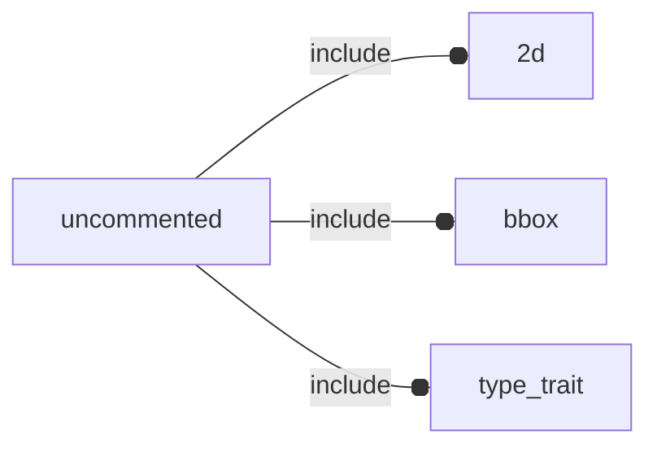

# package uncommented

## Dependencies



## Variables

---

### variable e

__Default:__

    2.71828

## Functions

---

### function fl_3d_AxisList

__Syntax:__

```text
fl_3d_AxisList(axes)
```

---

### function fl_3d_axisIsSet

__Syntax:__

```text
fl_3d_axisIsSet(axis,list)
```

## Modules

---

### module fl_cube

__Syntax:__

    fl_cube(verbs=FL_ADD,size=[1,1,1],octant,direction)

---

### module fl_cylinder

__Syntax:__

    fl_cylinder(verbs=FL_ADD,h,r,r1,r2,d,d1,d2,octant,direction)

