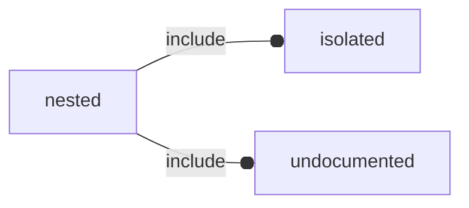

# package nested

## Dependencies



This file contains nested function and module that should be not published.


*Published under __GNU General Public License v3__*

## Functions

---

### function prefix_global_func

__Syntax:__

```text
prefix_global_func(param1,param2="default value")
```

public func to be published.


## Modules

---

### module prefix_global_module

__Syntax:__

    prefix_global_module(param1="default value for parm1",param2)

public module to be published.


